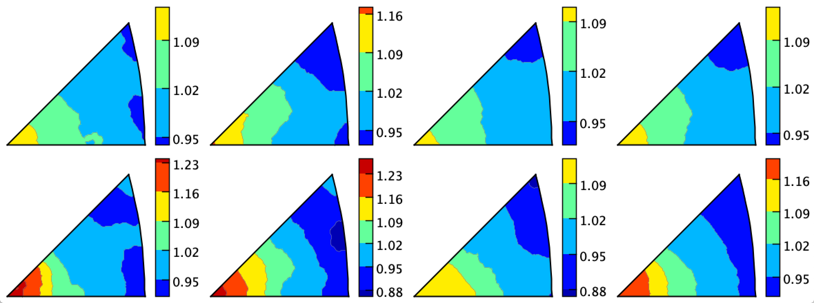
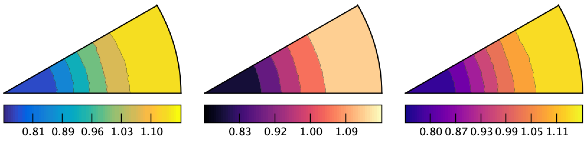
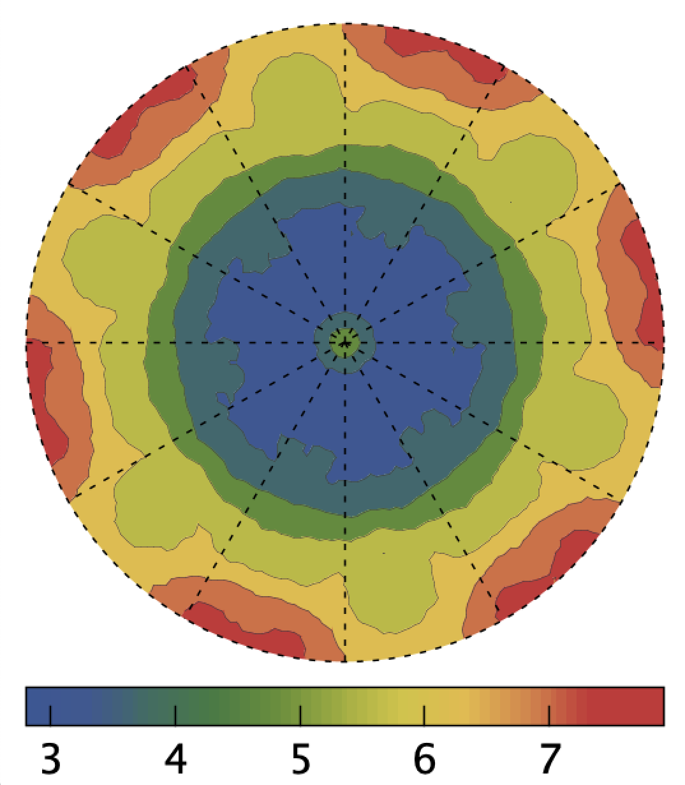
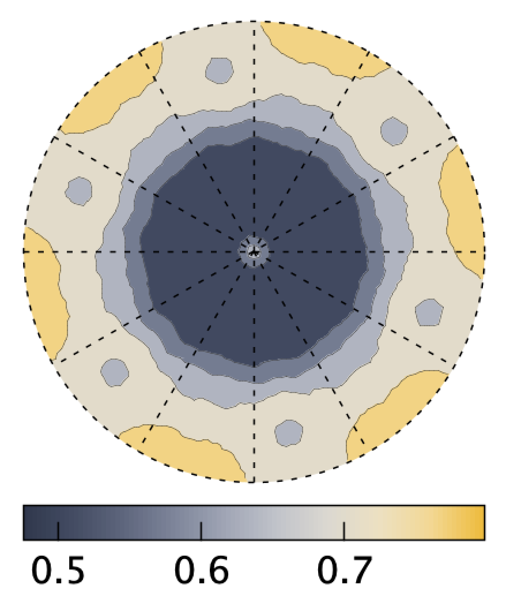

# gbcontourplot

#### Capabilities
*gbcontourplot* is a library written in Java (11). It allows for plotting isolines and isobands.
Among other options, one can define - at least to some extent - the "region function" specifying the area on which the contours are
visible, several color mappings and export to raster and vector formats are supported.

#### Motivation
During my graduate studies I needed to create contour plots restricted
to certain areas, varying from simple circles to areas restricted by
inequalities like *y* <= 1 + tan[ atan( 1 / cos *t* ) / 2 ] * cos *t*, where parameter t belongs to [- *pi* / 2, *pi* / 2].
Besides that, the plots needed to satisfy journal printing quality criteria.
The only tool that worked the way I wished was one of the Computer Algebra Systems.
These days I think about commercializing my know-how, but
since I am no longer eligible for a free (cheap) university (student) licence, I need a replacement.
Paying for a super expensive commercial license and use the CAS for plotting only would not be a wise
way of spending money :)

#### Disclaimer
Although I put an effort to provide as clear syntax as possible, there is probably a lot of space for improvements.
The library was intended to fully support several use cases rather than to be a general purpose tool.
Still, I would be happy if you find it useful (with or without some adjustments). 
Please share you thoughts -> ```kglowinski``` at ```ymail``` dot ```com```

#### Example
Java code for creating a ContourPlot (extending JPanel) is usually divided into
two steps.
First, we create the plot itself:
```java
List<Function2DValue> dataPoints = readDataPoints(ERROR_DATA);
Grid2DInterpolator interpolator = Grid2DInterpolator.from(dataPoints).withMaxNearest(7);
Grid2DValues gridValues = interpolator.interpolateOnGrid(-1, 1, -1, 1, 100, 100);
ColorMapper colorMapper = new TableBasedColorMapper(ColorMapTable.GRAY_YELLOW.name());
List<LineEnds> isoLines = gridValues.toIsoLines(4);
List<ColoredPolygon> isoBands = gridValues.toIsoBands(4, colorMapper);

ContourPlot contourPlot = new ContourPlot(-1, 1, -1, 1)
    .setBottomMargin(100)
    .setTopMargin(20)
    .setLeftMargin(20)
    .setRightMargin(20)
    .setContourWidth(400)
    .setContourHeight(400)
    .setBackgroundAndClear(WHITE)
    .addIsoBands(isoBands, insideCircle(1), INCLUSIVE)
    .addIsoLines(isoLines, DARK_GRAY, new BasicStroke(0.5f), insideCircle(1), EXCLUSIVE)
    .addCircularMargin()
    .addDashedCircumference()
    .addHexagonalAxes();
```
Then, we add a color bar:
```java
ColorBarBuilder colorBarBuilder = new ColorBarBuilder()
    .grid2DValues(gridValues)
    .setAutoIsoLevels(4)
    .labelLevels(asList(0.5, 0.6, 0.7, 0.8))
    .colorMapper(colorMapper)
    .colorBarLocation(BOTTOM)
    .left(20)
    .bottom(50)
    .width(400)
    .height(30)
    .font(new Font("DejaVu Sans Condensed", Font.PLAIN, 32))
    .floatingPointTemplate("%.1f")
    .barLabelSpacing(0)
    .continuous(true);

contourPlot.add(colorBarBuilder.build());

```
More examples can be found in ```demo``` directory/package.

#### Features

- Levels for isolines and isobands can be adjusted automatically
or specified manually
- Several color maps are supported: INFERNO, MAGMA, VIRIDIS, PLASMA, GRAY_YELLOW, RAINBOW, DARK_RAINBOW, PARULA, CIVIDIS, RED_BLUE, TEMPERATURE
- In color bar, levels can be discrete or continuous, ticks and labels can
be customized.
- Plots can be exported to raster and vector formats.
- Several hacks specific for the grain boundaries domain are added.
- Size of contour is adjustable.

#### Gallery

- Several plots with common scale. Discrete color bar.

- Different color maps. Continuous scale bars.

- Custom ticks and labels


